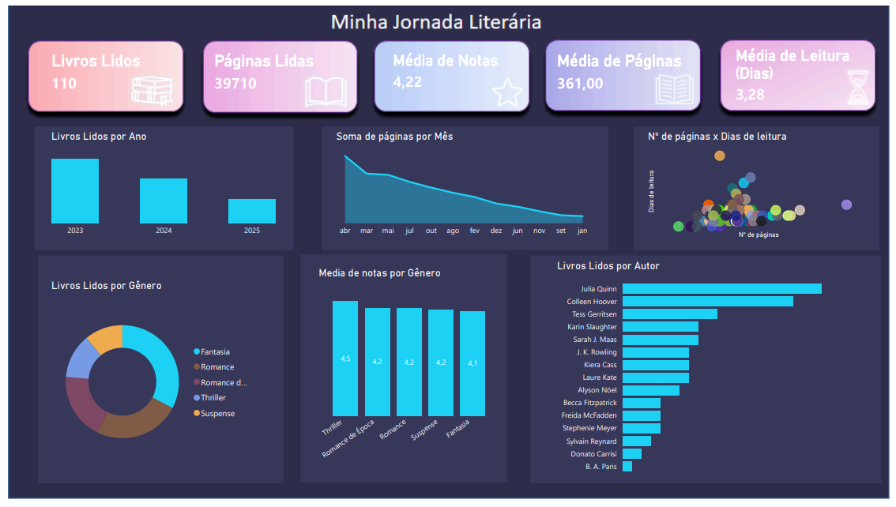

# 📚 Minha Jornada Literária & Análise de Dados

Este repositório contém meu **projeto de análise de leituras**, desenvolvido inicialmente no **Excel** e agora também em **Power BI**.  
Além de acompanhar minha evolução como leitora, o projeto tem o objetivo de **demonstrar minhas habilidades em análise de dados**, mostrando meu domínio das ferramentas e a capacidade de transformar dados em insights visuais.  

---

## 🎯 Objetivos do Projeto
- 📈 Acompanhar meu progresso de leitura ao longo do tempo  
- ✨ Identificar **autores mais lidos** e **gêneros preferidos**  
- ⏱️ Analisar **média de tempo de leitura** e **média de avaliação**  
- 📊 Criar dashboards visuais que **facilitem a interpretação de dados**  
- 💡 Demonstrar **domínio em Excel, Power BI e SQL** para análise de dados  

---

## 🛠️ Ferramentas Utilizadas
- 📝 **Excel** → Tabelas Dinâmicas, gráficos e análise de dados  
- 📊 **Power BI** → Dashboard interativo e visualizações avançadas  
- 🗄️ **GitHub** → Armazenamento e versionamento  
- 💻 **SQL** → Próxima etapa do projeto para consultas analíticas  

---

## 📊 Dashboards

### 1️⃣ Excel
Exemplo do painel construído no Excel:  

  

---

### 2️⃣ Power BI Interativo
Confira a versão interativa do dashboard abaixo:  

<iframe title="basededados" width="1140" height="541.25" src="https://app.powerbi.com/reportEmbed?reportId=e304338d-f70e-4b5f-97c7-b0b28c2d6641&autoAuth=true&embeddedDemo=true" frameborder="0" allowFullScreen="true"></iframe>

### 📸 Imagem do Dashboard Power BI
  

> ⚠️ Observação: A visualização interativa pode exigir login no Power BI ou navegador compatível.

---

## 📂 Estrutura do Repositório
- **Projeto Livros.xlsx** → Base de dados e dashboard em Excel  
- **painel.png** → Print do dashboard final em Excel  
- **dashboard_powerbi.png** → Print do dashboard final em Power BI  
- **LEIA-ME.md** → Documentação do projeto  

---

## 🚀 Próximos Passos
- [x] Dashboard em **Power BI** completo e interativo, com:  
  - 📊 Gráficos de livros lidos, autores mais lidos, gêneros preferidos  
  - ⏱️ Métricas de tempo médio de leitura e páginas por livro  
  - 🖱️ Interatividade com filtros e drill-through para explorar os dados detalhadamente  
- [ ] **SQL**:  
  - 🗂️ Criar banco de dados com livros, autores, gêneros e páginas  
  - 🔍 Realizar consultas analíticas, como:  
    - Quais autores são mais lidos?  
    - Média de avaliação por gênero  
    - Comparativos de leitura por período ou gênero  

✨ Desenvolvido por **Jamille**

