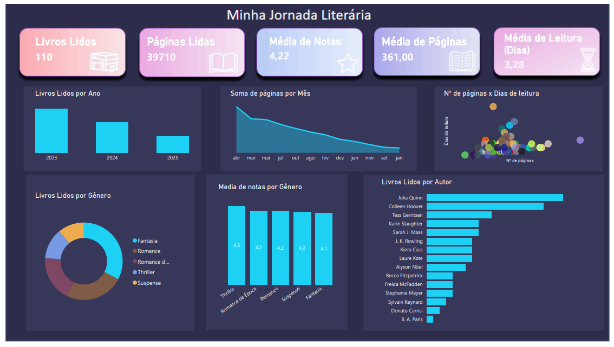
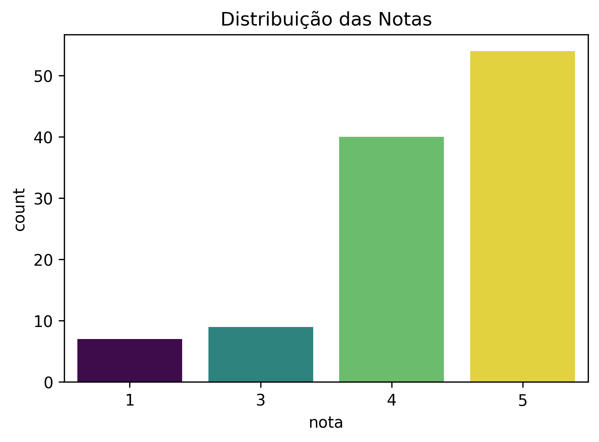
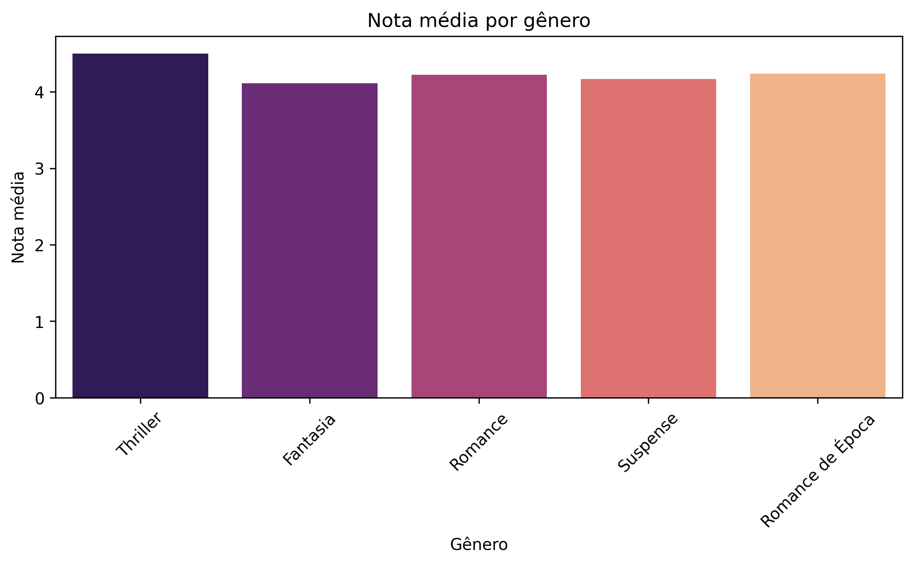

# 📚 Minha Jornada Literária & Análise de Dados

Este repositório contém meu **projeto de análise de leituras**, desenvolvido inicialmente no **Excel**, depois em **Power BI**, explorado em **SQL** e agora também em **Python**.  
O objetivo é acompanhar minha evolução como leitora e **demonstrar habilidades em análise de dados**, transformando informações em insights visuais.

---

## 🎯 Objetivos do Projeto
- 📈 Acompanhar meu progresso de leitura ao longo do tempo  
- ✨ Identificar **autores mais lidos** e **gêneros preferidos**  
- ⏱️ Analisar **média de tempo de leitura** e **média de avaliação**  
- 📊 Criar dashboards visuais que **facilitem a interpretação de dados**  
- 💡 Demonstrar **domínio em Excel, Power BI, SQL e Python**  

---

## 🛠️ Ferramentas Utilizadas
- 📝 **Excel** → Tabelas Dinâmicas, gráficos e análise de dados  
- 📊 **Power BI** → Dashboard interativo e visualizações avançadas  
- 💻 **SQL** → Consultas analíticas na base de livros  
- 🐍 **Python** → Pandas, Matplotlib e Seaborn para análises e gráficos automatizados  
- 🗄️ **GitHub** → Armazenamento e versionamento  

---

## 📊 Dashboards e Consultas

### 1️⃣ Excel
Exemplo do painel construído no Excel:  

---

### 2️⃣ Power BI Interativo
Confira a versão interativa do dashboard abaixo:  

<iframe title="basededados" width="1140" height="541.25" src="https://app.powerbi.com/reportEmbed?reportId=e304338d-f70e-4b5f-97c7-b0b28c2d6641&autoAuth=true&embeddedDemo=true" frameborder="0" allowFullScreen="true"></iframe>

### 📸 Imagem do Dashboard Power BI
  

> ⚠️ Observação: A visualização interativa pode exigir login no Power BI ou navegador compatível.

---

### 3️⃣ Consultas SQL
Utilizei **SQL** para explorar a base de dados de livros, criando consultas como:  
- Quantidade de livros lidos por ano  
- Quantidade de livros por gênero  
- Top autores mais lidos  
- Total e média de páginas lidas  
- Ritmo e eficiência de leitura  
- Livros mais longos e mais curtos  
- Livros com maior e menor nota por gênero  

Arquivo SQL disponível na pasta [`SQL/`](SQL/Jornada_literaria.sql)

---

### 4️⃣ Análise em Python
Nesta etapa, utilizei **Python (Pandas, Matplotlib e Seaborn)** para explorar a base de livros e gerar insights adicionais:

- 📊 **Gráficos criados**:  
  - [Distribuição de notas dos livros](./graficos/distribuicao_notas.png)  
  - [Tempo médio de leitura por ano](./graficos/tempo_medio_por_ano.png)  
  - [Top 10 autores mais lidos](./graficos/autores_mais_lidos.png)  
  - [Nota média por gênero](./graficos/nota_media_por_genero.png)  
  - [Relação entre número de páginas e nota](./graficos/relacao_paginas_nota.png)  

- 🔍 **Estatísticas e análises**:  
  - Total de livros lidos e páginas lidas  
  - Média de páginas por livro  
  - Média de avaliação (nota) e média de dias por leitura  
  - Meses com mais leituras  
  - Correlação entre número de páginas e nota  

- 💻 **Automatização e visualização**:  
  - Criação automática da pasta `graficos` para salvar imagens  
  - Visualizações exportadas em alta qualidade (PNG)  
  - Preparação da base de dados com tratamento de datas e padronização de colunas  

> ✅ Todos os gráficos e métricas foram gerados automaticamente a partir do script `Python/jornada.py`  

### 📸 Exemplos de Gráficos Python

---

## 📂 Estrutura do Repositório
- **Excel/Projeto Livros.xlsx** → Base de dados e dashboard em Excel  
- **painel.png** → Print do dashboard final em Excel  
- **PowerBI/Dashboard.pbix** → Arquivo do dashboard em Power BI  
- **dashboard_powerbi.png** → Print do dashboard final em Power BI  
- **SQL/consultas_minha_jornada.sql** → Consultas SQL  
- **Python/jornada.py** → Script de análise e gráficos em Python  
- **graficos/** → Pasta com os gráficos gerados em Python  
- **README.md** → Documentação do projeto  

---

✨ Desenvolvido por **Jamille**
