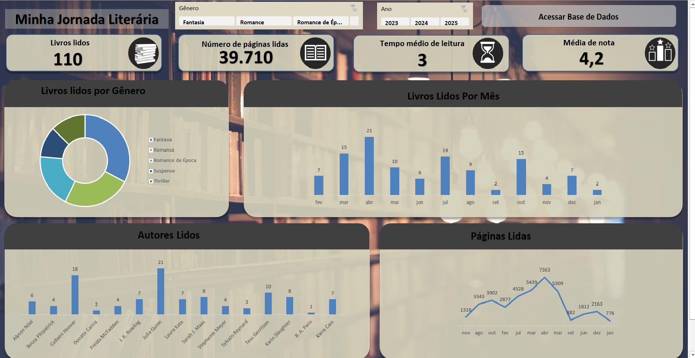

# 📚 Minha Jornada Literária

Este repositório contém meu **projeto de análise de leituras**, desenvolvido inicialmente no **Excel**.  
O objetivo é acompanhar minha evolução como leitora, explorando métricas como quantidade de livros lidos, páginas, autores e gêneros preferidos.  

---

## 🎯 Objetivos do Projeto
- Acompanhar meu progresso de leitura ao longo do tempo.  
- Identificar **autores mais lidos** e **gêneros preferidos**.  
- Analisar **média de tempo de leitura** e **média de avaliação**.  
- Criar dashboards visuais que facilitem a interpretação dos dados.  

---

## 🛠️ Ferramentas Utilizadas
- **Excel** (Tabelas Dinâmicas e Gráficos)  
- **Power BI** (próxima etapa do projeto)  
- **GitHub** (armazenamento e versionamento)  

---

## 📊 Dashboard
Aqui está um exemplo do painel construído no Excel:  

  

---

## 📂 Estrutura do Repositório
- **Projeto Livros.xlsx** → Base de dados e dashboard em Excel.  
- **painel.png** → Print do dashboard final.  
- **LEIA-ME.md** → Documentação do projeto.  

---

## 🚀 Próximos Passos
- [ ] Migrar o dashboard para o **Power BI**.  
- [ ] Adicionar novas métricas (livros mais rápidos/demorados, páginas por gênero etc).  
- [ ] Criar versões interativas do painel.  

---

✨ Desenvolvido por **Jamille**

